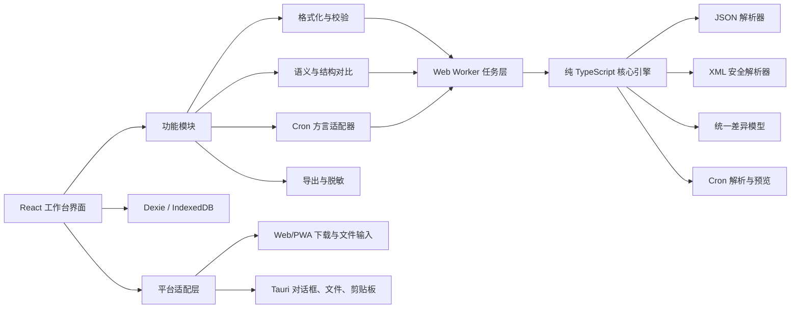

# worktools 产品与技术设计方案

> 文档状态：V1 方案草案  
> 目标平台：Web / PWA + Windows 桌面安装版  
> 核心定位：面向 API 对接人员的本地优先报文处理工作台

---

## 1. 方案结论

建议开发一套名为 **worktools** 的工具：同一套前端代码同时发布为 Web/PWA 和 Windows 安装包，所有 JSON、XML、Cron、对比及导出操作默认在本机完成，不上传业务报文。

首版不要做成 Postman 的替代品，也不要一开始引入账号、云同步、团队空间和插件系统。产品只专注于 API 对接过程中最高频、最耗时的四类工作：

1. JSON/XML 报文格式化、校验、查看和检索；
2. 报文内容对比、结构对比和差异定位；
3. Cron 表达式生成、反向解析和执行时间预览；
4. 原始报文、格式化报文和对比报告导出。

### 1.1 产品目标

- 粘贴报文后，最多两次操作即可完成格式化或进入对比；
- 既能比较“值有没有变化”，也能比较“接口结构有没有变化”；
- Cron 不仅能生成，还能识别不同方言并反向还原为可编辑配置；
- 对比完成后可以直接导出给供应商、研发、测试或产品人员；
- 默认不联网、不自动上传、不自动永久保存敏感报文；
- Web 和 Windows 版本保持相同的核心能力和操作逻辑。

### 1.2 明确不做的内容

以下内容不进入 V1，避免把工具做重：

- 完整 HTTP 请求调试和接口集合管理；
- 登录、云同步、团队协作、权限系统；
- AI 自动分析报文；
- OpenAPI/Swagger 全量管理；
- 插件市场和脚本执行环境；
- 数据库连接、消息队列连接或抓包代理。

这些功能只有在核心报文工作流稳定后，才按真实需求逐项评估。

---

## 2. 用户与典型场景

### 2.1 目标用户

- API 对接开发人员；
- 供应商接入、渠道接入、酒店/订单/支付接口对接人员；
- 后端开发、测试、实施和技术支持人员；
- 经常从日志、文档、聊天软件、抓包结果中复制 JSON/XML 的人员。

### 2.2 高频工作流

#### 场景 A：快速检查供应商响应

1. 从日志或接口调试工具复制响应；
2. 打开“格式化”；
3. 自动识别 JSON/XML；
4. 查看语法错误、字段树、字段路径和基础统计；
5. 复制某个字段或导出格式化报文。

#### 场景 B：比较两次接口响应

1. 将旧报文放在左侧、新报文放在右侧；
2. 选择“语义对比”或“结构对比”；
3. 设置忽略字段，例如时间戳、traceId、token；
4. 如果数组顺序不稳定，按 `id`、`code`、`hotelId` 等字段匹配；
5. 逐项定位差异；
6. 脱敏后导出 HTML、Markdown 或 CSV 报告。

#### 场景 C：确认接口结构是否变更

1. 导入生产样例和供应商新样例；
2. 选择“只比较结构”；
3. 查看新增字段、删除字段、类型变化、可空性变化和数组元素结构变化；
4. 导出结构变更清单交给研发或测试。

#### 场景 D：生成或理解 Cron

1. 粘贴一个未知 Cron；
2. 选择或自动判断 Unix、Spring、Quartz 方言；
3. 显示中文解释并反向填充到可视化配置；
4. 修改分钟、小时、日期或星期规则；
5. 预览未来若干次执行时间；
6. 复制表达式或导出说明。

---

## 3. 信息架构

产品采用“左侧功能导航 + 顶部任务标签 + 中央工作区 + 底部状态栏”的开发工具型结构。

### 3.1 一级导航

| 导航 | 主要用途 |
|---|---|
| 首页 | 快速进入功能、打开工作区、查看显式保存的最近项目 |
| 格式化 | JSON/XML/TXT 格式化、校验、树形查看、搜索 |
| 报文对比 | 文本、语义、结构三种对比模式 |
| Cron 工具 | 生成、反向解析、中文解释、执行时间预览 |
| 工作区 | 查看已保存、已固定的本地工作内容 |
| 设置 | 主题、密度、编辑器、默认对比规则、隐私和导出设置 |

### 3.2 顶部任务标签

每个格式化、对比或 Cron 任务都以标签页存在，允许并行处理多个供应商或多个接口。

标签页显示：

- 任务名称；
- 类型图标；
- 未保存状态；
- 固定状态；
- 关闭按钮。

临时标签关闭后默认删除内容；只有用户明确点击“保存工作区”或“固定”后才持久化。

### 3.3 全局框架尺寸建议

- 顶部应用栏：44px；
- 左侧导航：折叠 52px，展开 208–224px；
- 任务标签栏：36px；
- 底部状态栏：24px；
- 主工作区：占满剩余区域；
- 面板之间使用可拖动分隔条；
- 桌面端优先适配 1200px 以上宽度。

---

## 4. 页面布局详细设计

## 4.1 首页

首页不做传统数据仪表盘，而是作为高效入口。

### 页面区域

1. **快速开始**
   - 格式化报文；
   - 对比两个报文；
   - 解析 Cron；
   - 打开本地文件；
   - 打开已保存工作区。

2. **最近工作区**
   - 仅显示用户主动保存或固定的内容；
   - 显示名称、类型、最后修改时间和来源文件名；
   - 支持固定、重命名、复制和删除。

3. **隐私提示**
   - 明确显示“报文默认仅在本机处理”；
   - 显示当前是否启用临时会话；
   - 不使用夸张弹窗干扰操作。

4. **快捷提示**
   - 只展示 3–5 个最常用快捷键；
   - 可关闭，不重复打扰。

---

## 4.2 格式化页面

### 顶部工具栏

从左到右：

- 类型选择：自动 / JSON / XML / 文本；
- 打开文件；
- 粘贴；
- 格式化；
- 压缩；
- 校验；
- 搜索；
- 复制；
- 导出；
- 更多选项。

### 主工作区

默认使用 65% 编辑器 + 35% 检查器的布局。

#### 左侧：原始报文编辑器

- 语法高亮；
- 行号；
- 折叠；
- 括号匹配；
- 搜索和替换；
- 错误行标记；
- 大文件模式提示；
- 当前选区的字符数和行数。

#### 右侧：检查器

包含三个标签：

1. **树形视图**
   - 展开/折叠节点；
   - 复制字段值；
   - 复制 JSONPath/XPath 风格路径；
   - 显示值类型；
   - 搜索字段名和值。

2. **结构视图**
   - 只显示字段和类型；
   - JSON 展示 object/array/string/number/boolean/null；
   - XML 展示 element/attribute/text、重复次数和层级；
   - 可作为结构基线保存。

3. **问题列表**
   - 错误级别；
   - 行列位置；
   - 错误说明；
   - 点击跳转编辑器对应位置。

### 底部状态栏

显示：

- 自动识别的格式；
- 字符数、行数、文件大小；
- 校验状态；
- 编码；
- 本地处理状态。

### 关键交互

- 用户粘贴后自动识别，但不自动改写原文；
- 第一次点击格式化时才写回格式化结果；
- 格式化前保留一次撤销快照；
- JSON 大整数不得因为解析而改变精度；
- 遇到重复 JSON Key 时给出警告，不假装可以无损进行对象级对比；
- XML 遇到 `DOCTYPE` 或外部实体时默认拒绝解析并给出安全提示。

---

## 4.3 报文对比页面

这是整个产品的核心页面。

### 顶部对比控制栏

- 对比模式：文本 / 语义 / 结构；
- 报文类型：自动 / JSON / XML / 文本；
- 开始对比；
- 上一个差异 / 下一个差异；
- 交换左右；
- 对比设置；
- 导出结果。

### 中央双栏编辑区

左侧和右侧各占 50%。每侧包含：

- 自定义标题，例如“旧版本”“供应商响应”“生产环境”；
- 打开文件；
- 粘贴；
- 清空；
- 格式化；
- 文件名、大小和校验状态；
- 编辑器正文。

支持：

- 同步滚动；
- 差异行高亮；
- 折叠未变化区域；
- 点击差异列表跳转；
- 左右内容交换；
- 单独复制任意一侧。

### 底部结果抽屉

默认占工作区高度的 30%–35%，可折叠或拖动调整。

包含四个标签：

1. **摘要**
   - 新增、删除、修改、类型变化数量；
   - 校验错误；
   - 使用的对比模式和规则；
   - 对比耗时。

2. **差异清单**
   - 状态；
   - 字段路径；
   - 左侧类型和值；
   - 右侧类型和值；
   - 差异说明。

3. **结构变化**
   - 新增字段；
   - 删除字段；
   - 字段类型变化；
   - null 与缺失变化；
   - 数组元素结构变化；
   - XML 属性和重复节点变化。

4. **导出预览**
   - 报告标题；
   - 左右版本标签；
   - 是否包含完整原文；
   - 脱敏规则；
   - 导出格式和预览。

在 1600px 以上宽屏上，可允许用户把结果抽屉停靠到右侧，形成约 360px 的差异列表面板。

---

## 5. 对比能力设计

## 5.1 三种对比模式

### A. 文本对比

适合：

- 普通文本；
- 需要检查空格、换行、字段顺序的场景；
- JSON/XML 无法成功解析时的兜底。

规则：逐行比较，不改变原文。

### B. 语义对比

适合：比较报文实际内容，不受无意义格式变化影响。

JSON 默认行为：

- 忽略对象 Key 顺序；
- 默认不忽略数组顺序；
- 区分数字 `1` 和字符串 `"1"`；
- 区分字段缺失和字段值为 `null`；
- 可配置忽略指定字段路径；
- 可为对象数组指定匹配 Key。

XML 默认行为：

- 忽略缩进产生的空白；
- 忽略属性书写顺序；
- 保留元素顺序语义；
- 区分属性、子元素和文本；
- 命名空间前缀及 URI 在 V1 中按明确规则处理，不自动猜测等价关系。

### C. 结构对比

只关注结构，不关注具体业务值。

JSON 比较：

- 字段新增、删除；
- 字段类型变化；
- object 与 array 变化；
- null 与非 null；
- 数组元素的合并结构；
- 可选统计字段在样例中的出现率。

XML 比较：

- 元素新增、删除；
- 属性新增、删除；
- 文本节点类型；
- 同名元素重复次数；
- 父子层级变化；
- 元素与属性之间的形态变化。

结构对比应作为一级功能，而不是语义对比中的一个小开关。

## 5.2 对比设置

### 通用设置

- 忽略空白；
- 忽略大小写；
- 忽略指定路径；
- 只比较指定路径；
- 严格类型比较；
- `null` 与缺失是否等价；
- 数字精度策略；
- 最大差异数量；
- 对比超时和取消。

### 数组设置

- 按顺序比较；
- 忽略顺序；
- 按指定 Key 匹配；
- 自动建议可能的唯一 Key；
- Key 重复时明确报错或退回顺序模式，不能静默产生错误结果。

### 忽略规则示例

- `$.timestamp`
- `$.traceId`
- `$.data[*].updateTime`
- XML 的属性路径和元素路径

规则可保存为本地模板，例如：

- “订单响应默认忽略字段”；
- “酒店静态信息忽略字段”；
- “供应商 A 时间字段”。

规则模板进入 P1，不阻塞首版基础能力。

---

## 6. Cron 工具设计

Cron 的难点不是生成界面，而是不同系统的字段数量和特殊字符语义不完全一致。因此必须先选择方言，再生成、解析和预览。

## 6.1 支持的方言

| 方言 | 字段 | V1 能力 |
|---|---:|---|
| Unix/Linux | 5 | 生成、解析、中文解释、未来执行时间 |
| Spring | 6 | 生成、解析、中文解释、未来执行时间 |
| Quartz | 6/7 | 生成、解析、中文解释；特殊规则按能力分级预览 |

界面必须显示当前方言，不能只放一个 Cron 输入框。

## 6.2 页面布局

### 顶部表达式栏

- 方言选择；
- Cron 表达式输入框；
- 解析；
- 复制；
- 清空；
- 时区选择；
- 校验状态。

### 左侧：可视化生成器（约 62%）

按字段分组：

- 秒（Spring/Quartz）；
- 分钟；
- 小时；
- 日期；
- 月份；
- 星期；
- 年份（Quartz 可选）。

每个字段支持：

- 每次；
- 指定值；
- 范围；
- 间隔；
- 多选；
- 方言支持的特殊规则。

提供常用预设：

- 每 5 分钟；
- 每小时；
- 每天指定时间；
- 每周工作日；
- 每月指定日期；
- 每月最后一天（仅支持方言）；
- 每月第 N 个星期几（仅支持方言）。

### 右侧：解析结果（约 38%）

- 中文自然语言说明；
- 字段逐项说明；
- 未来 10 次执行时间；
- 当前时区；
- 夏令时提示；
- 方言兼容性警告；
- 不支持预览的特殊字符提示。

## 6.3 反向解析原则

- 输入合法表达式后，将其反向填入可视化控件；
- 无法完全映射为简单控件的表达式，保留原表达式并切换到“高级规则”；
- 不应为了展示而把表达式错误简化；
- `?`、`L`、`W`、`#` 等特殊字符必须按方言说明；
- 如果底层执行时间计算器不支持某个特殊规则，只显示解释和兼容性警告，不能给出伪造的未来时间。

---

## 7. 导出能力设计

## 7.1 报文导出

支持：

- `.json`
- `.xml`
- `.txt`
- 复制到剪贴板
- 保留原始格式或使用格式化格式

导出前显示：

- 文件名；
- 格式；
- 编码；
- 是否已脱敏；
- 文件大小。

## 7.2 对比报告导出

### HTML 报告（首选）

- 单文件，可离线打开；
- 包含摘要、差异清单和可选的左右报文；
- 颜色、图标和文字共同表达差异；
- 不依赖远程脚本、字体或 CDN；
- 内容严格转义，不能执行报文中的 HTML/脚本。

### Markdown 报告

适合粘贴到：

- GitHub/GitLab Issue；
- Wiki；
- 邮件；
- 工单系统。

### CSV 差异清单

列建议：

- 状态；
- 字段路径；
- 左侧类型；
- 右侧类型；
- 左侧值；
- 右侧值；
- 说明。

### PDF

V1 不直接引入复杂 PDF 渲染库，优先通过 HTML 报告的打印功能生成 PDF。只有确认批量或模板化 PDF 是高频需求后，再增加原生 PDF 导出。

## 7.3 脱敏规则

预置敏感字段建议：

- `Authorization`
- `token`
- `accessToken`
- `password`
- `secret`
- `cookie`
- `phone`
- `email`
- `idCard`

脱敏必须：

- 由用户确认后执行；
- 导出前提供预览；
- 显示哪些路径已被处理；
- 不静默修改编辑器中的原始报文；
- 支持全部隐藏、保留前后字符和自定义替换文本。

---

## 8. 视觉与交互风格

## 8.1 设计方向

定位为“专业、紧凑、可信赖的开发者工作台”，不要做成营销网站，也不要套用过于通用的后台管理模板。

### 色彩

- 主背景：石墨灰、墨色和中性灰；
- 强调色：青色或蓝绿色；
- 新增：绿色；
- 删除：红色；
- 类型变化：琥珀色；
- 移动或顺序变化：蓝色；
- 所有颜色都配合图标和文字，避免只依赖颜色传达状态。

### 主题

- 浅色；
- 深色；
- 跟随系统；
- 紧凑密度；
- 舒适密度。

### 字体

- 中文界面使用系统无衬线字体；
- 编辑器使用 Cascadia Code、JetBrains Mono 或等宽系统字体回退；
- 数字、括号和缩进需要清晰区分。

### 间距与组件

- 采用 4px/8px 间距体系；
- 工具栏高度约 32–36px；
- 表格行支持紧凑和舒适两档；
- 主要操作使用文字按钮，次要操作可使用图标按钮；
- 图标按钮必须有 Tooltip 和无障碍标签。

## 8.2 快捷键

首版只提供少量高价值快捷键：

| 快捷键 | 操作 |
|---|---|
| `Ctrl+K` | 打开命令面板 |
| `Ctrl+Shift+F` | 格式化当前报文 |
| `Ctrl+Enter` | 执行当前页面主操作：对比/解析 |
| `Alt+↑ / Alt+↓` | 上一个/下一个差异 |
| `Ctrl+S` | 保存当前工作区 |
| `Ctrl+O` | 打开文件 |

快捷键可以在设置中查看，V1 暂不做复杂的自定义映射。

## 8.3 响应式策略

- **桌面 1200px 以上**：完整双栏和多面板体验；
- **平板或窄窗口**：左右编辑器可切换为上下布局；
- **手机**：允许格式化、查看和简单 Cron 解析；复杂双栏对比采用只读堆叠布局；
- 产品核心仍以桌面和 Windows 工作场景为主，不为移动端牺牲桌面效率。

---

## 9. 技术选型

## 9.1 推荐技术栈

| 层级 | 技术 | 选择理由 |
|---|---|---|
| 前端框架 | React + TypeScript | 组件生态成熟，适合复杂编辑器和多面板状态 |
| 构建工具 | Vite | 开发启动和构建简单，适合 Web 静态发布 |
| Windows 容器 | Tauri 2 | 复用 Web 前端，可构建 Windows 安装包，原生能力按权限开放 |
| 编辑器 | Monaco Editor | 支持代码编辑、语法高亮和双栏 Diff Editor |
| UI 状态 | Zustand | 足够轻量，不为本地工具引入复杂全局框架 |
| 本地数据库 | IndexedDB + Dexie | Web 和桌面 WebView 可共用，适合显式保存的工作区 |
| 数据校验 | Zod | 校验工作区、设置和导入导出数据结构 |
| 后台计算 | Web Workers | 大报文解析、格式化和对比不阻塞界面线程 |
| 图标 | Lucide | 图标风格统一，避免自制不一致图标 |
| 样式 | CSS Variables + 轻量组件原语 | 便于实现开发工具风格、深浅主题和密度切换 |

## 9.2 为什么选 Tauri，而不是只做 Web

只做 Web 的优点是零安装、部署简单，但本地文件打开、保存目录选择和 Windows 使用体验受浏览器限制。

Tauri 版本可以：

- 提供 Windows 安装包；
- 使用系统文件打开/保存对话框；
- 支持拖入本地文件；
- 在明确授权后访问文件和剪贴板；
- 复用 Web 的 React 页面和核心处理代码。

因此推荐：

- Web/PWA 用于随时打开和轻量使用；
- Windows 安装版作为日常主力版本；
- 两个版本共享核心模块，不维护两套业务逻辑。

## 9.3 为什么不优先选 Electron

Electron 也能实现需求，而且生态成熟，但会同时携带 Chromium 和 Node.js。对这个以文本处理为主、无需重型 Node 运行时的工具而言，Tauri 更符合轻量安装和最小权限原则。

如果后续出现必须依赖 Node 原生模块、复杂浏览器自动化或 Electron 专属生态的需求，再重新评估，不提前为假设需求增加体积。

---

## 10. 核心处理方案

## 10.1 JSON

推荐使用容错扫描/语法树方案处理原始文本，避免简单地通过 `JSON.parse` 后再序列化所有内容。

目标：

- 格式化和压缩不改变大整数文本；
- 保留明确的错误位置；
- 可识别注释、尾逗号等非标准输入并提示；
- 可检测重复 Key；
- 对合法标准 JSON 提供结构树和语义对比。

建议：

- 格式化与错误定位使用 `jsonc-parser`；
- 合法标准 JSON 再进入结构推断和语义对比；
- 存在重复 Key 时标记为歧义报文，语义对比需要用户确认或退回文本模式。

## 10.2 XML

推荐使用 `fast-xml-parser` 的稳定修复版本，并额外增加输入限制。

原则：

- 禁止外部实体；
- 默认拒绝 `DOCTYPE`；
- 限制最大深度、节点数和输入大小；
- 保留元素、属性、文本、CDATA 和顺序信息；
- 格式化、结构推断和对比分开处理；
- 依赖版本固定并纳入安全更新检查。

## 10.3 Diff

建议组合两层能力：

1. Monaco Diff Editor 负责可视化文本差异；
2. 自定义标准化和结构比较引擎负责 JSON/XML 的语义及结构差异。

差异引擎输出统一结构：

```ts
type DiffChange = {
  kind: 'added' | 'removed' | 'changed' | 'type-changed' | 'moved';
  path: string;
  leftType?: string;
  rightType?: string;
  leftValue?: unknown;
  rightValue?: unknown;
  message: string;
};
```

这样编辑器高亮、差异列表和导出报告都使用同一份结果，避免三套逻辑产生不一致。

## 10.4 Cron

推荐采用“方言适配器”而不是一个通用函数：

```ts
interface CronDialectAdapter {
  id: 'unix' | 'spring' | 'quartz';
  validate(expression: string): ValidationResult;
  parse(expression: string): CronModel;
  build(model: CronModel): string;
  describe(expression: string, locale: string): string[];
  getNextRuns(expression: string, timezone: string, count: number): Date[];
  getCapabilities(): CronCapabilities;
}
```

建议依赖：

- `cRonstrue`：生成人类可读说明；
- `cron-parser`：处理其明确支持的表达式和未来执行时间；
- Quartz/Spring 特殊字符：由方言层校验、解释并标记预览能力。

特别注意：底层库并不天然完整覆盖所有 Quartz 特殊字符，因此 `W` 等高级规则不能直接宣称支持执行时间计算。V1 宁可明确提示“不支持预览”，也不能显示错误时间。

## 10.5 导出

- Web：使用 Blob 和浏览器下载；
- Windows：使用 Tauri 文件保存对话框和最小范围文件权限；
- HTML 报告由本地模板生成；
- Markdown/CSV 使用统一 `DiffChange[]` 输出；
- 导出逻辑保持纯 TypeScript，平台层只负责选择路径和写文件。

---

## 11. 系统架构



### 11.1 模块目录建议

```text
src/
  app/
  components/
  features/
    formatter/
    diff/
    cron/
    export/
    workspaces/
    settings/
  core/
    json/
    xml/
    diff/
    cron/
    export/
    masking/
  workers/
  storage/
  platform/
    web/
    tauri/
  styles/
src-tauri/
  capabilities/
  src/
```

规则：

- `core` 不依赖 React 和 Tauri；
- `features` 负责页面业务；
- `platform` 隔离 Web 与 Windows 差异；
- `src-tauri` 只保留必要的原生壳和权限配置；
- 不为了未来插件系统提前设计复杂扩展点。

---

## 12. 本地数据模型

```ts
type Workspace = {
  id: string;
  name: string;
  type: 'format' | 'diff' | 'cron';
  createdAt: string;
  updatedAt: string;
  pinned: boolean;
  sensitiveMode: boolean;
};

type PayloadDocument = {
  id: string;
  label: string;
  format: 'json' | 'xml' | 'text';
  rawText: string;
  sourceName?: string;
  encoding?: string;
};

type CompareOptions = {
  mode: 'text' | 'semantic' | 'structure';
  ignoreWhitespace: boolean;
  ignorePaths: string[];
  strictTypes: boolean;
  missingEqualsNull: boolean;
  arrayMode: 'sequence' | 'unordered' | 'match-by-key';
  arrayKey?: string;
};

type CronDocument = {
  dialect: 'unix' | 'spring' | 'quartz';
  expression: string;
  timezone: string;
  builderState: Record<string, unknown>;
};

type ExportProfile = {
  format: 'html' | 'markdown' | 'csv' | 'json' | 'xml' | 'text';
  includeMetadata: boolean;
  includePayloads: boolean;
  maskRules: MaskRule[];
};
```

### 持久化原则

- 临时任务默认只保存在内存；
- 用户明确保存或固定后才写入 IndexedDB；
- 不自动持久化剪贴板内容；
- 设置、忽略规则和导出模板可以单独保存；
- 提供“一键清除本地数据”；
- 后续可增加加密工作区，但不阻塞 V1。

---

## 13. 安全与隐私设计

## 13.1 本地优先

- 格式化、解析、对比、Cron 和导出全在本机执行；
- 首版不需要后端服务；
- 不接入远程分析脚本；
- 不使用远程 CDN；
- 默认不采集报文内容、字段名和导出文件名。

## 13.2 Windows 权限

- Tauri 能力按页面和命令最小化配置；
- 文件系统和剪贴板能力默认不开；
- 只有用户主动点击“打开”“保存”“复制”时调用；
- 不允许任意目录后台扫描；
- 不允许执行报文中的脚本或命令。

## 13.3 Web 安全

- 配置严格 CSP；
- HTML 报告中所有业务文本进行转义；
- 文件预览不使用 `innerHTML` 直接渲染报文；
- 导入工作区文件必须进行结构校验和大小限制；
- XML 解析执行实体、深度和节点数量防护。

---

## 14. 性能策略

以下是 V1 的设计目标，必须通过真实样例基准测试确认，不作为未验证承诺。

### 文件分级

| 大小 | 策略 |
|---:|---|
| 0–2 MB | 实时校验、格式化、树视图和对比 |
| 2–20 MB | Web Worker 按需处理，减少实时计算 |
| 20 MB 以上 | 明确警告，关闭实时树和自动语义对比，建议桌面版处理 |

### 技术措施

- 格式化、解析和 Diff 放入 Web Worker；
- 输入变化使用防抖；
- 新任务可以取消旧 Worker；
- 树形视图和差异列表使用虚拟滚动；
- 未变化的大段内容折叠；
- 只在用户请求时生成完整导出报告；
- 对大文件限制树深度和首屏节点数量；
- 性能异常时允许切换回文本模式。

### 初始基准目标

- 1 MB 报文格式化：典型开发电脑上目标低于 300ms；
- 10 MB 报文按需处理：目标低于 2s；
- UI 主线程不出现长时间无响应；
- 所有长任务可取消并显示进度状态。

---

## 15. Web 与 Windows 功能差异

| 能力 | Web/PWA | Windows 安装版 |
|---|---|---|
| 粘贴、格式化、对比 | 支持 | 支持 |
| 文件上传 | 浏览器文件选择 | 原生文件选择、拖放 |
| 文件保存 | 浏览器下载 | 原生保存路径 |
| 工作区 | IndexedDB | IndexedDB/WebView 本地数据 |
| 安装 | 浏览器/PWA，支持程度依平台 | MSI 或 Setup 安装包 |
| 离线 | PWA 缓存后可用 | 默认离线可用 |
| 剪贴板 | 受浏览器权限约束 | 用户操作时调用原生能力 |
| 文件夹批量处理 | 能力受限 | P1 可实现 |

Web 版不能因为能力限制而维护独立业务逻辑；差异全部收敛到平台适配层。

---

## 16. MVP 范围与优先级

## 16.1 P0：首个可用版本

### 工作区

- 多标签任务；
- 临时任务；
- 显式保存、重命名、复制和删除；
- 深浅主题；
- Web 与 Windows 基础发布。

### 格式化

- JSON/XML/TXT；
- 自动识别；
- 格式化、压缩、校验；
- 编辑器、树视图、错误跳转；
- 打开、复制、导出。

### 对比

- 文本对比；
- JSON 语义对比；
- JSON/XML 结构对比；
- XML 基础语义对比；
- 忽略路径；
- 数组按顺序或指定 Key；
- 差异列表与导航；
- HTML、Markdown、CSV 导出；
- 导出脱敏预览。

### Cron

- Unix、Spring、Quartz 方言选择；
- 常用规则生成；
- 反向解析；
- 中文解释；
- 支持范围内的未来执行时间；
- 不支持规则的明确警告。

## 16.2 P1：效率增强

- 保存结构基线并与新报文比较；
- 对比规则模板；
- 脱敏规则模板；
- 批量文件对比；
- 文件夹导入和批量导出；
- `.apiwork` 工作区包；
- 命令面板；
- 最近文件；
- 可选自动更新。

## 16.3 P2：验证需求后再做

- 简易 HTTP 请求重放；
- OpenAPI/JSON Schema 导入；
- 从样例生成 Schema；
- 团队共享；
- 加密云同步；
- 插件机制；
- AI 字段说明或变更摘要。

---

## 17. 交付阶段建议

按单人开发估算，一个打磨到可日常使用的 V1 约需 3–4 周，具体取决于 XML 保真度、大文件性能和 Quartz 高级语法覆盖范围。

### 阶段 0：需求冻结与交互原型（2–3 天）

- 确认三种核心页面；
- 确认结构对比规则；
- 确认 Cron 方言范围；
- 做可点击原型；
- 验证双栏布局和结果抽屉。

验收：核心流程无需解释即可完成。

### 阶段 1：基础框架与格式化（4–6 天）

- React/Vite/Tauri 基础工程；
- 工作区和多标签；
- Monaco 编辑器；
- JSON/XML 格式化、校验和树视图；
- Web/Windows 文件打开和导出。

验收：真实报文能在 Web 和安装版完成格式化与导出。

### 阶段 2：对比与报告（6–9 天）

- 文本 Diff；
- JSON/XML 标准化；
- 语义和结构对比；
- 忽略路径和数组 Key；
- 差异列表；
- HTML/Markdown/CSV 导出；
- 脱敏预览。

验收：同一批测试样例在编辑器、差异列表和导出报告中的结果一致。

### 阶段 3：Cron、安全与性能（4–6 天）

- Cron 可视化生成和反向解析；
- 方言兼容性；
- Worker 和大文件策略；
- CSP、Tauri 权限和 XML 安全；
- 快捷键、主题和可访问性。

验收：Cron 结果与对应方言样例一致；不支持能力有明确提示。

### 阶段 4：打包与验收（3–5 天）

- Web 构建和 PWA；
- Windows 安装包；
- 真实文件、剪贴板、导出和重启恢复测试；
- 性能基准；
- 发布说明和使用文档。

验收：全新 Windows 环境可以安装、离线使用、导入、对比和导出。

---

## 18. 测试与验收清单

## 18.1 JSON 样例

- 大整数；
- Unicode 和中文；
- 转义字符；
- 深层嵌套；
- 空对象和空数组；
- 重复 Key；
- 尾逗号；
- 注释；
- 非法字符串；
- 数字和数字字符串；
- `null` 与字段缺失。

## 18.2 XML 样例

- 命名空间；
- 属性；
- CDATA；
- 注释；
- 混合内容；
- 自闭合节点；
- 重复节点；
- 不同属性顺序；
- `DOCTYPE` 和实体攻击样例；
- 超深层级和大量节点。

## 18.3 Diff 样例

- 只改变格式；
- 对象字段换序；
- 数组换序；
- 数组按 Key 匹配；
- Key 重复；
- 字段新增和删除；
- 类型变化；
- `null` 与缺失；
- 忽略路径；
- XML 属性和元素变化。

## 18.4 Cron 样例

- 每分钟、每小时、每天、每周、每月；
- Unix 5 字段；
- Spring 6 字段；
- Quartz 6/7 字段；
- `?`、`L`、`W`、`#`；
- 非法字段范围；
- 时区和夏令时边界；
- 不支持能力的警告。

## 18.5 端到端验收

必须分别在 Web 生产构建和重新打包的 Windows 版本中验证：

1. 粘贴 JSON → 格式化 → 查找字段 → 导出；
2. 导入两份 XML → 结构对比 → 定位差异 → 导出报告；
3. 数组按业务 Key 对比；
4. 应用脱敏规则并预览；
5. 粘贴 Cron → 反向解析 → 修改 → 复制；
6. 保存工作区 → 关闭应用 → 重新打开恢复；
7. 临时敏感任务关闭后不出现在最近工作区；
8. 断网后核心功能仍可使用。

---

## 19. 成功标准

V1 是否成功，不以功能数量衡量，而以以下结果衡量：

- 粘贴报文后，两步内完成格式化；
- 用户能在 5 秒操作内开始对比并定位第一个差异；
- 结构变化与值变化可以明确区分；
- 对比报告不需要人工重新整理即可发给协作方；
- 所有核心处理在断网情况下工作；
- 没有用户明确操作时，不上传或永久保存业务报文；
- Windows 版本可以正常安装、打开文件、保存报告和离线运行；
- Web 与 Windows 对同一输入产生一致结果。

---

## 20. 最终推荐

首版采用：

- **React + TypeScript + Vite**；
- **Tauri 2** 发布 Windows 安装版；
- **Monaco Editor** 承载编辑和文本差异；
- **Web Worker** 处理大报文；
- **Dexie/IndexedDB** 保存用户明确保存的工作区；
- **jsonc-parser + 安全配置的 fast-xml-parser** 处理报文；
- **方言适配器 + cRonstrue + cron-parser** 处理 Cron；
- **本地 HTML/Markdown/CSV** 完成报告导出。

优先把“格式化、语义对比、结构对比、Cron 反解、脱敏导出”打磨到稳定，再考虑请求调试、Schema、AI 或云协作。这样可以用最小范围覆盖 API 对接工作中最常见、最值得自动化的重复劳动。